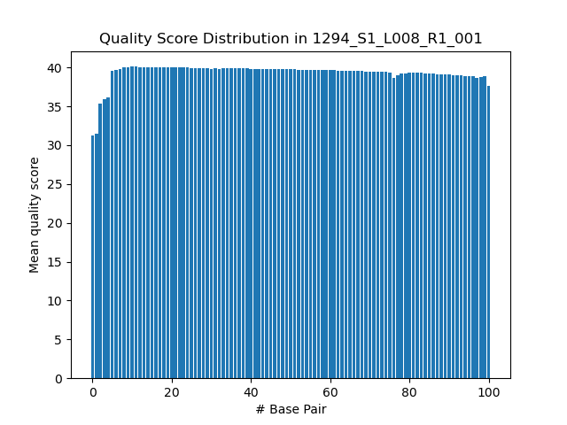
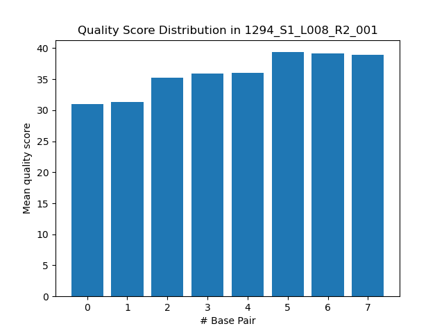
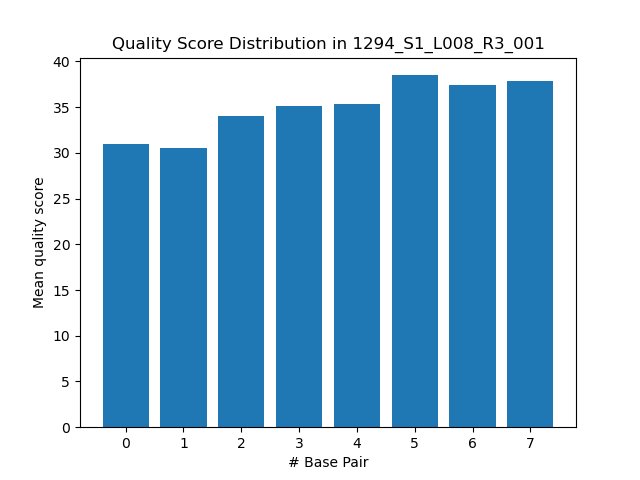
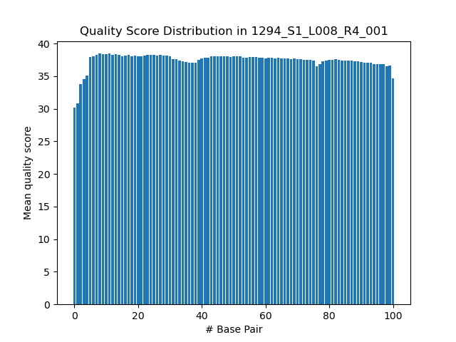

# Assignment the First

## Part 1
1. Be sure to upload your Python script.

| File name | label |
|---|---|
| 1294_S1_L008_R1_001.fastq.gz | read1 |
| 1294_S1_L008_R2_001.fastq.gz | index1 |
| 1294_S1_L008_R3_001.fastq.gz | index2 |
| 1294_S1_L008_R4_001.fastq.gz | read2 |

2. Per-base NT distribution

    1. 
  
  
    
    
    
    
   2. 
    
```
The cutoff I chose for average quality score for reads from files R1 and R4 (read 1 and read 2) is Q20. This is because the probability that a base with a Q-score of 20 is correct is 99%, which is acceptable because the reads from this experiment (mRNA-seq) will be aligned to a reference in later steps, so we don't need to be too stringent with the cutoff; we would like to have as much data as possible while still aligning things correctly, and 1 base being wrong out of every 100 seems acceptable for the purpose of alignment.
The cutoff I chose for index reads (files R2 and R3) is Q30 for each individual base. In other words, if any one quality score in the index read has a quality score lower than 30, the entire read pair is thrown out. This is because every single base matters to correctly map the read pair to the sample it came from, and if any one base is wrong, we may end up mapping the read pair to the wrong sample. Therefore, applying the quality score cutoff to each base rather than to the average across the read makes sense, because it allows us to have confidence that every single base in the index is correct. I chose a cutoff of Q30 for the index sequences, because this is the negative log of Illumina's average error rate (0.1%).
```
   3. 
```
zcat /projects/bgmp/shared/2017_sequencing/1294_S1_L008_R2_001.fastq.gz | sed -n '2~4p' | grep 'N' | wc -l
zcat /projects/bgmp/shared/2017_sequencing/1294_S1_L008_R3_001.fastq.gz | sed -n '2~4p' | grep 'N' | wc -l
3976613 (R2) + 3328051 (R3)= 7,304,664 total indexes with Ns
```
    
## Part 2
1. Define the problem
```
We want to trace back our biological reads to the samples they came from using the corresponding index reads. However, when index hopping occurs, it can lead to reads being incorrectly mapped back to the wrong samples. By creating a library for sequencing that has dual-matched indexes (meaning that index 1 and index 2 are the same for both sequences), we can check whether read pairs came from fragments with index hopping. We want to sort read pairs from input FASTQs (two FASTQs containing index reads and two FASTQs containing biological reads) into categories: one category for each barcode/sample, one category for incorrectly-matched index pairs, and one category for index pairs that are unknown or of low sequencing quality.
```
2. Describe output
```
The program should output 52 FASTQ files: two files per correctly-matched index (one file has read 1 reads and the other has read 2 reads), two files containing reads with incorrectly-matched indexes (aka index-swapped read pairs), and two files containing reads with unknown or low-quality index reads. In this specific case, there are 24 different indexes, which means that we will have (2*24) + 2 + 2 = 52 output FASTQs. We also want our program to return, either to the terminal or in a file containing standard output, the number of correctly matched read pairs for each barcode, the total number of correctly matched read pairs, the number of incorrectly matched read pairs for each possible wrong pair, the total number of incorrectly matched read pairs (aka index-swapped read pairs), and the number of read pairs that have unknown or low-quality indexes.
```
3. Upload your [4 input FASTQ files](../TEST-input_FASTQ) and your [>=6 expected output FASTQ files](../TEST-output_FASTQ).

4. Pseudocode
```
open barcodes file (indexes.txt) for reading
    pull out barcode names and barcodes, put in dictionary (barcode name is key, barcode sequence is value). NOTE: might want to change this around for ease of checking whether/which barcode the index seqs match to
    keep a counter of the number of indexes encountered so that we know how many files to open for writing
close barcodes file

open R1, R2, R3, and R4 (aka read 1, index 1, index 2, read 2, respectively) for reading and open ((number of indexes)*2)+4) files for writing (2 files per correctly matched index, 2 files for index-swapped reads, and 2 files for unknown/low-quality indexed reads)
    -name files open for writing based on the names of the barcodes (the keys in the barcode dictionary) and have an R1 and R2 file for each barcode name. Also have R1 and R2 files for "unknown" and "swapped" categories
(keep them open by not using with open)

Loop through all 4 files that are open for reading (r1, r2, i1, i2) line by line in parallel
    initialize a line counter to keep track of line number
    if the line is a header line (line number divided by 4 returns a remainder of 1), store the header (minus the stuff after the space) in a temporary variable. Only needs to be done for one file because the headers should all match
    if the line is a sequence line (line number divided by 4 returns a remainder of 2), store the sequence in a temporary variable (needs to be done for all four files, stored in different temporary variables named r1_seq, r2_seq, i1_seq, i2_seq)
    if the line is the third line of the fastq record (line number divided by 4 returns a remainder of 3), store that in temporary variables for r1 and r2
    if the line is the quality score line (line number divided by 4 returns a remainder of 0), store the quality score in a temporary variable (needs to be done for all four files, named with suffixes r1, r2, i1, i2)
    increment the line counter

    after extracting and storing information for 1 record from all four files, check which category the reads fit in:
    initialize 'unknown' counter to 0
    initialize a dictionary to count the occurrences of each possible pair of indexes (both dual-matched and swapped). From the barcodes dictionary, pull out barcode names and make each possible pair (there should be 24*24 = 576 total pairs) a key; set each value to 0 initially.
    change the value stored in header temp variable to header-i1_seq-i2_seq
    change the temporary variable store in i2_seq to its reverse complement
    check if the sequences stored in i1_seq and i2_seq (remember that i2_seq has already been rev comp'd) are both in barcodes dictionary AND that there are no Ns in either index sequence AND that the index sequences pass quality cutoff (Q=30 for each individual base in seq)
        if not, then output header-i1_seq-i2_seq as header, r1(/r2) seq, r1(/r2) 3rd line, and r1(/r2) q scores to unknown.R1.fq (/unknown.R2.fq) file; also increment 'unknown' counter by 1
        if yes, move on to next check
    check if i1_seq is equal to i2_seq (remember that i2_seq has already been rev comp'd)
        if not, then output header-i1_seq-i2_seq as header, seqs, 3rd lines, and q scores to swapped.R1.fq and swapped.R2.fq; also find barcode names by referring to barcodes dictionary and then increment value in counter dictionary for key that corresponds to the pair of indexes
        if yes, then move on to next check
    check which barcode names the barcode sequences map to by referencing barcode dictionary
        output header-i1_seq-i2_seq as header, seqs, 3rd lines, and q scores to R1 and R2 files for that specific barcode name; also find barcode names by referring to barcodes dictionary and then increment value in counter dictionary for key that corresponds to the pair of indexes

return unknown counter and keys/values of counter dictionary, plus sums of correctly matched and swapped counts (use a list of possible correctly matched and possible incorrectly matched indexes in order to choose what values from dictionary go into each sum)

close files
```
5. High level functions. For each function, be sure to include:
    1. Description/doc string
    2. Function headers (name and parameters)
    3. Test examples for individual functions
    4. Return statement
```
def rev_comp(sequence: str) --> str:
    '''Takes a sequence in the 5'->3' direction and returns its reverse complement in the 5'->3' direction'''
    return rev_comp_seq: str

input: 'ATG'
output: 'CAT'
```
```
def convert_phred(letter: str) --> int:
    '''Takes a letter encoded in Phred+33 and returns the Phred score (quality score)'''
    return score: int
    
input: 'I'
output: 40
```
```
def write_to_fastq(bucket: str):
    '''Takes a bucket/category name ('unknown,' 'swapped', or barcode name) and outputs one record to the R1.fastq file for that category and one record to the R2.fastq file for that category. Returns None.'''
    (return: None)

input: 'A1'
output: None
(the return statement is None, but when you call the function it should write one record each to files A1.R1.fq and A1.R2.fq)
```
